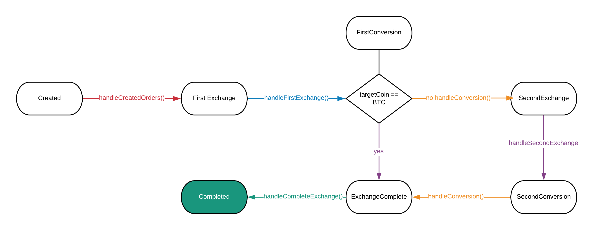

# Adrestia Process Documentation

## handleCreateOrder() created -> first Exchange
1. Broadcasts transaction that sends from HotWallet to exchange.
2. Saves txid.

## handleNthExchange() exchange -> conversion
1. Checks sent amount has arrived to exchange an it is usable.
2. If balance has arrived, creates selling order at market price.

## handleConversion() conversion -> exchange
                                    completed
1. Checks the order has been completed.
2. Checks if it is the last conversion or requires a second one. 
    a. if it is last conversion marks order as ExchangeComplete
    b. Withdraws converted BTC to second exchange.
    
## handleCompletedExchange()
1. Sends converted assets to target HotWallet.
